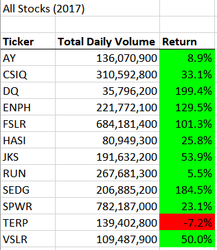
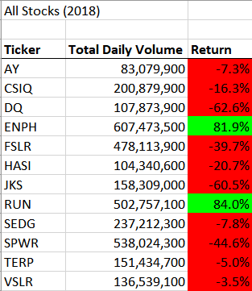
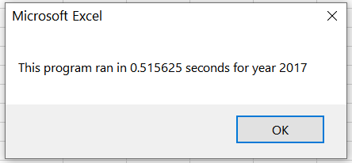
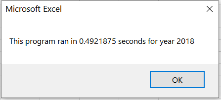
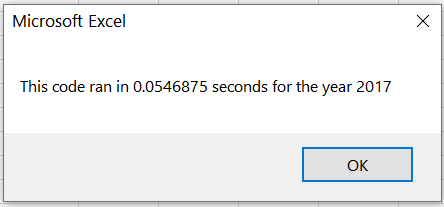
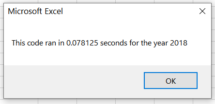

# Green Stocks Analysis

## Project Overview
This project created two distinct VBA scripts to analyze the yearly trade volume and returns for stocks from 12 green energy companies[^tickers].  We used data from 2017 and 2018 and applied conditional formatting to easily display which companies had positive vs. negative returns.  

[^tickers]: Atlantica Sustainable Infrastructure PLC (**AY**), Canadian Solar Inc. (**CSIQ**), Daqo New Energy Corp (**DQ**), Enphase Energy, Inc. (**ENPH**), First Solar, Inc (**FLSR**), Hannon Armstrong Sustainable Infrastructure Capital, Inc. (**HASI**), JinkoSolar Holding Co., LTD (**JKS**), SunRun Inc. (**RUN**), SolarEdge Technologies, Inc. (**SEDG**), SunPower Corporation (**SPWR**), Terraform Power (**TERP**), Vivint Solar (**VSLR**).

### Purpose
Our initial goal was to create a simple, easy to read list of relevant information about the companies in order to help new investors make decisions.  We chose to focus on *trade volume* and *returns*, as that data was both readily available and relatively easy to understand for a new investor.  *Trade volume* is the total number of stocks traded in a time frame, for this project we used looked at the trade volume for one year.  *Returns* indicate the percentage of an investment that is earned or lost over a time period.  Once we had created a script to perform that analysis, we went back and refactored that code.  Our initial design worked well for the data we were working with, but we realized it would become inefficient for larger data sets, especially if our client wanted to add new companies to the analysis. 

## Results

### Stock Analysis
To calculate the yearly trade volume, we simply took the sum of daily trade volumes for each company.  Trade volume is useful for analyzing trends, and skilled investors use these trends to predict how stock values will change.  Even without the experience and knowledge to make those predictions, trade volume is a useful indicator of market volatility.  If trade volume is higher, there is typically less volatility in the market, so there is less risk to an investor.  However, profit margins are often smaller as well.[^volume]

[^volume]: https://smartasset.com/financial-advisor/high-volume-stocks

To calculate the returns, we used the following equation:

$$ Return = \frac{Ending Value}{Starting Value} - 1$$

In which the *Ending Value* is the closing price for the last day of the year, and *Starting Value* is the closing price for the first day of the year.  This formula gives us the percentage change between the starting and closing value.  Within the [Excel workbook](VBA_Challenge.xlsm), we applied conditional formatting to highlight positive returns green and negative returns red to make it easy to read at a glance. 

#### 2017
In 2017, green energy companies mostly had positive returns - only one of the twelve we analyzed had negative returns, Terraform Power, with a 7.2% decrease.  The other companies ranged from SunRun's 5.5% increase to Daqo's 199.4% increase.  Our full results, including the formatting, are pictured below:



#### 2018
2018 was a significantly less successful year than 2017, with only two companies yielding positive returns.  Enphase, with 81.4% returns, and SunRun, with 84.0% returns, had strong showings, while the other companies ranged from Antlantica's -7.4% returns to Daqo's -62.6% returns.  The full results for 2018 are shown below:



#### Year to Year Comparison
Both Sunrun and Enphase had dramatic increases in trade volume, with Sunrun increasing by 88% and Enphase increasing by 174% yearly trade volume.  Daqo's trade volume also increased significantly, nearly tripling with a 201% increase in volume despite their poor returns.  Interestingly, Terraform Power also showed an increase in trade volume, despite consistently negative yearly returns.  The other companies had less dramatic changes in volume, with some increasing and some decreasing.  With the data available to us, we do not have enough information to determine what caused these companies returns to decrease as they did.

### Performance Analysis

#### Original Code
Our [original code](year_value_analysis.vbs) utilized a nested for-loop to iterate through each row of our worksheet for each ticker on the list.  
```
'loop through all tickers
    For i = 0 To 11
    
        ticker = tickers(i)
        totalVolume = 0
        'loop through rows in data
        Worksheets(yearValue).Activate
        For j = 2 To RowCount
        ...
        Next j
    Next i
```
It's easy to see how increasing the number of companies to analyze would increase both the number of rows and the number of tickers, leading to increasingly frustrating runtimes.  With the 12 companies used for this project, our runtime was around 0.516 seconds for 2017 and 0.492 seconds for 2018, as captured in the screenshots below:





With the [new code](VBA_Challenge.vbs), we removed the need for nested for loops by introducing arrays to contain the starting value, the ending value, and the total volume for each ticker.  
```
 'Create output arrays
    Dim tickerVolume(12) As Long
    Dim tickerStartingPrices(12) As Single
    Dim tickerEndingPrices(12) As Single
```
With these arrays, we were able to iterate through each row in a single loop, using `if` statements to change the index when moving to a new ticker.  
```
For i = 2 To RowCount
        ticker = tickers(tickerIndex)
        'Increase volume for current ticker
        tickerVolume(tickerIndex) = tickerVolume(tickerIndex) + Cells(i, 8).Value
        
        'Check if the current row is the first row with the selected tickerIndex.
        If Cells(i, 1).Value = ticker And Cells(i - 1, 1).Value <> ticker Then
            tickerStartingPrices(tickerIndex) = Cells(i, 6).Value
        End If
        
        'Check if the current row is the last row with the selected ticker
         'If the next row’s ticker doesn’t match, increase the tickerIndex.
        If Cells(i, 1).Value = ticker And Cells(i + 1, 1).Value <> ticker Then
            tickerEndingPrices(tickerIndex) = Cells(i, 6).Value

            'Increase the tickerIndex.
            tickerIndex = tickerIndex + 1
            
        End If
    
    Next i
```
With this change, our runtimes decreased to 0.055 seconds for 2017 and 0.078 seconds for 2018, as shown below:





## Summary

### Pros and Cons of Refactoring
Broadly speaking, refactoring is usually done to make code easier to read, more efficient to run, or to allow for broadening the scope of a program.  Often, the first code we write isn't the best it could be, because it's easier to figure out what works and go from there than to worry about being perfect right off the bat.  However, refactoring has an upfront time cost, and for instances where runtime is small or the code is rarely used, it may not be worth that time to make it more efficient.  When working on larger coding projects than this, one also has to make sure that refactoring one section doesn't interfere with how other sections of the code run, or that it's feasible to adjust those other sections as well.

In the case of this project, our original code used less memory, as it was creating and storing objects instead of arrays.  However, the refactored code runs significantly faster, a difference that would only grow more noticeable as the data set increased in size.  Our original code was also faster and easier to write, saving time up front.  For the small data set we were working with, the fractions of a second we saved on runtime probably wouldn't warrant the effort to refactor, but the refactor allows us to use the same script for grander analyses in the future.
